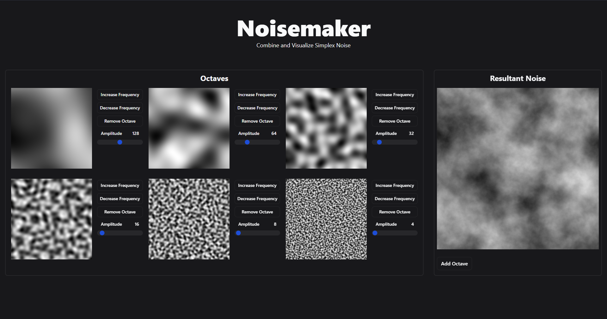

# Noisemaker

A web-based application for visualizing Simplex Noise. Written in Svelte.



---

## Running Noisemaker

Once you've cloned this repository, run `npm install` (or `pnpm install` or `yarn`) to install the necessary dependencies.

```bash
npm install

# or you're preferred package manager
yarn install
```

Then, run the development build with `npm run dev`
```bash
npm run dev
```

## Takeaways

---

- I gained experience with another front-end framework (Svelte)
- I learned how to absorb information about complex algorithms and use them in my own projects